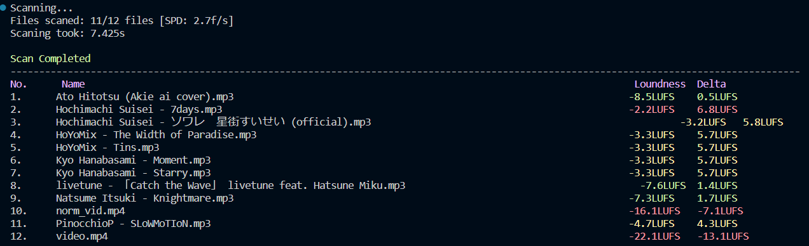

# FFnorm.js

automatic audio Normalization tool
powered by **FFmpeg**
for normalizing large batch of files.


## Installation

The only dependencies required is **FFmpeg** and **Node.js** (for running the source code).
didn't have them? Download [FFmpeg](https://ffmpeg.org/download.html) or [Node.js](https://nodejs.org/en/download).

## Usage
you can either run the Executable directly:
```
ffnorm norm -i "path/to/input/folder" "path/to/input/folder"
```

or run the source code var **Node.js**:
```
node ffnorm.js norm -i "path/to/input/folder" "path/to/input/folder"
```

#### Scan files Loundness
input path can be File or Folder
```
ffnorm scan -i "path/to/input/folder"
```
you can also spacifiy **Target** loudness as guide line
```
ffnorm scan -i "path/to/input/folder" --target -9
```
**FFnorm** will mark how far-off each file's loudness from **Target**


#### Nomalize Files
lets start by normalizing a single Video file,
we defined **Max Offset** to `2LUFS` meaning if this file is only `2LUFS` away
from default **Target loudness** (-14.4LUFS) it would be skiped.
```
ffnorm norm -i ./test/video.mp4 -of 2 ./test/norm_vid.mp4
```

for multiple files we can spacify Folder path instead of File,
**FFnorm** will look for [supported files](#supported-files-extentions) in the given folder and normalize them
```
ffnorm norm -i ./test -of 2 ./test/norm/
```


## Options


| Option | Descriptions | | Default | Note |
|---|---|---|---|---|
| `'-i'`, `'--input'` | specify input file/folder| string | None | this option is **required** |
| `'-o'`,`'--output'` | specify output file/folder| string | None | (if none set will use the last command-line argument as output) |
|`'norm'`, `'--norm'`, `'-n'`| Normalize mode - scan Audio loundness of file/folder contents and normalize them according to the Target loudness set by '-t' option.| (No Value needed for this option) | None |  (this option **requires Output file/folder**) |
| `'scan'`,`'--scan'`, `'-s'` | Scan Audio loudness and report them on the terminal. | (No Value needed for this option)| None |
| `'-t'`, `'--target'` | Target Loudness in LUFS | float | `-14.4` (LUFS) (*YouTube* standard loudness) | |
| `'-of'`, `'--offset'`| Max offset fron Target loudness before normalization become active. | float | `1.3` (LUFS) | |
|`'-r`', `'--ratio'` | How much Nomalization is apply in percentage, 1.0 is 100% lower this value to prevent over-shooting | float | `0.78` (78%) | |
|`'-st'`,`'--scanthread'`| Max number of Threads for loudness scanning | int | `128` (threads) | |
|`'-nt'`, `'--normthread'`| Max number of Threads for audio normalization | int |`32` (threads)| |

## Supported Files Extentions
> - aiff
> - aif
> - aifc
> - flac
> - mp3
> - mp4
> - mp4a
> - mkv
> - mov
> - wav
> - webm

---------------

#### FFmpeg Commands use:
- getting audio loundness
> `ffmpeg -hide_banner -i audio.wav -af ebur128=framelog=verbose -f null - 2>&1 | awk '/I:/{print $2}'`
- modifying audio Gains
> `ffmpeg -hide_banner -y -i input.wav -movflags use_metadata_tags -map_metadata 0 -af "volume=GAINdB" -id3v2_version 3 -c:v copy ouput.wav`
